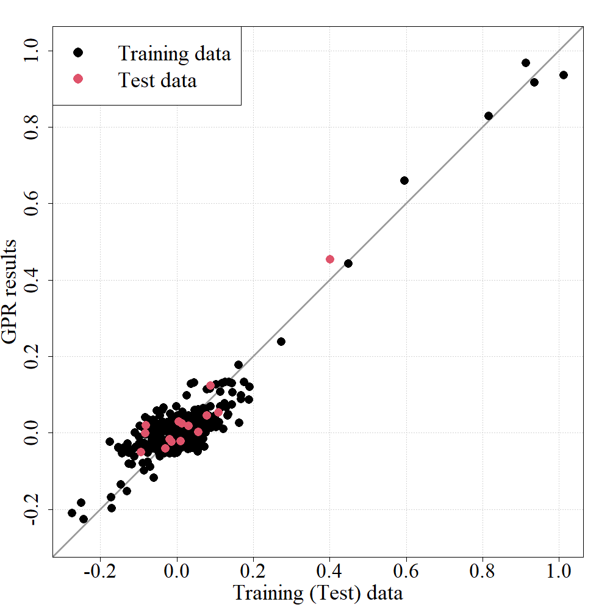
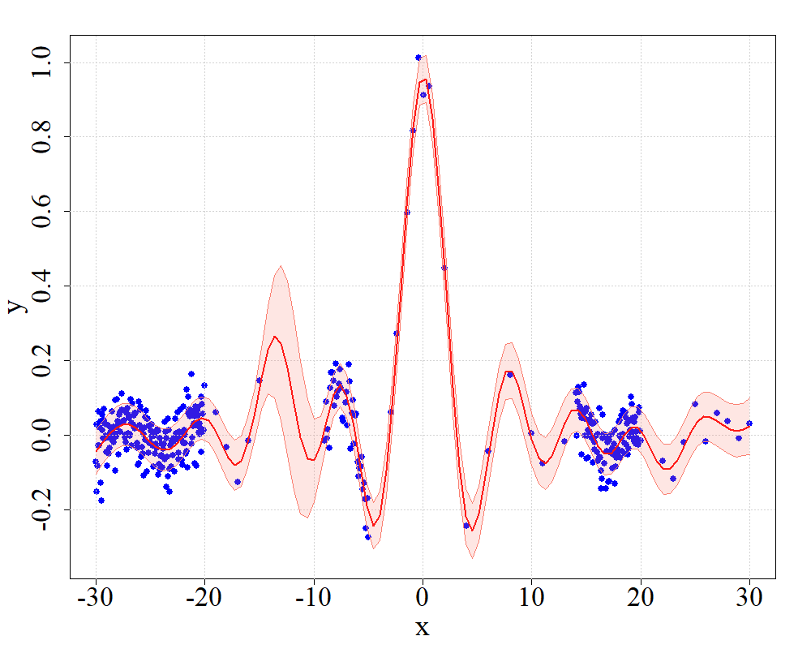
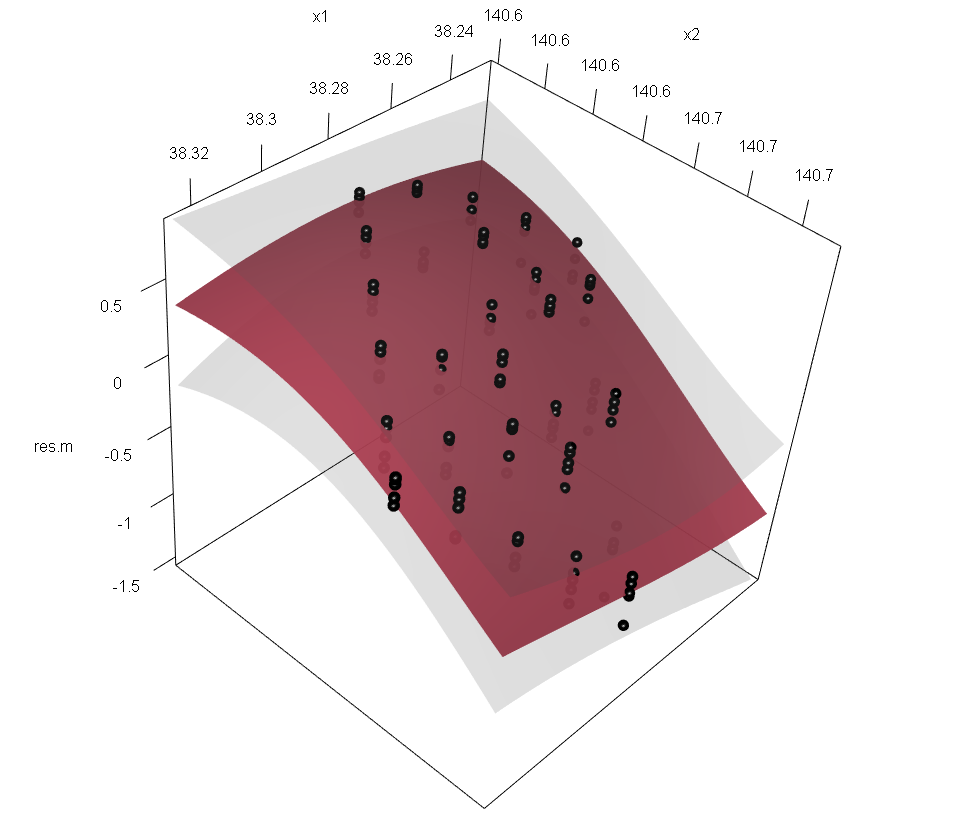

# Gaussian Process Regression(ガウス過程回帰)   

 - ガウス過程回帰を用いて補間や応答曲面を構築するためのコード   
 - 2つのバージョンが存在，それぞれカーネル関数が異なる    
 - v2の方が高度（ハイパーパラメータ数が多い)，そのため2つのバージョンでハイパーパラメータの探索方法が異なっている    

## 入力データ

### 学習用データ (/data/training.txt)  
 - 学習用の入出力データが含まれるファイル  
 - 最後の列に出力データ，それ以外の列に入力データが並ぶデータ

### 検証用データ (/data/test.txt)  
 - 構築したモデルの精度を検証するためのデータ   
 - データ形式は入力データと同じ   
 - (なくてもよい)

## 出力データ

### 学習用ケースの再構築の結果 (/res/res_training.txt)    
 - 学習用データの入力値を構築したモデルに代入した時の出力値  
 - 1行目に平均値，2行目に標準偏差

### 検証用データの出力結果 (/res/res_test.txt)    
 - 検証用データの入力値を代入したときの出力値  
 - 1行目に平均値，2行目に標準偏差

### ハイパーパラメータ(/res/hpar.txt)

## 関数の説明
 - f.ker: カーネル関数   
 - f.gpr: ガウス過程回帰の関数（評価したい入力値x2に対応する出力値を返す関数）   
 
 - f.cv : クロスバリデーションの関数(ver1)    
 - decide.hpar: ガウス過程回帰のハイパーパラメータを決定するための関数(ver1)      
 
 - f.lh : 尤度関数の計算(ver2)     
 - hpar_○○: 勾配法orMCMC(マルコフ連鎖モンテカルロ法)を用いてハイパーパラメータを決定(ver2)      

## プログラムの流れ
 - Functions: 関数の定義   
 - Read data: データの読みこみ   
 - Find hyper-parameter: ハイパーパラメータの設定     
 - Reconstruction: 学習データの入力値を構築したモデルで評価     
 - Result for test data: 検証用データの結果を出力    
 - Compare GPR results with data (Plot): GPRの結果とデータの出力結果の比較   
 - Graph: (入力が1次元or2次元の場合) GPRの結果をグラフ（ばらつきを含む）で表現     

## 出力される図の例    
 - GPRの結果とデータの出力結果の比較   

 - 出力値の標準偏差を含んだ形のグラフ     
 

